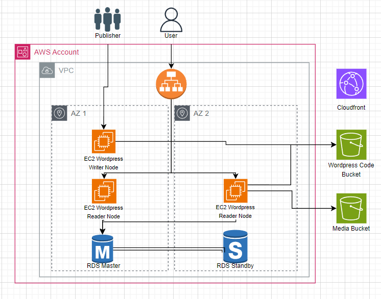

# AWS Deploying Wordpress

## 1. Project Description:
We will try to interate the wordpress with the AWS and launch the wordpress publicly by leveraging some AWS services so it would be easy to manage.

## 2. Pipeline Architecture Design:

### The explanation:
   - EC2 Write: Write the content
   - EC2 Read: Read the content from two different bucket (One from the main content and media for image or videos)
   - Cloudfront would help to reduce the cost by deploy it to the edge, so it can be accessed in the closer AWS region by the user
   - Application Load Balancer would help to manage the user to get the healthy ec2 read instance.
   - We have to database master (as the main database) and standby as the backup if there is a problem. They will be put in the different AZ (Availability Zone) so we can use it as disaster recovery
   - Auto Scaling group would help to manage the number of EC2 following the needs (it could be shrink down or shrink up depends on the demands)

## 3. Procedure:
### 3.1. Create 2 S3 bucket with name "rlp-code-aws" and "rlp-media-aws". Retain the default settings.
### 3.2. Create a new cloudfront distribution and select the origin domain name as the media s3 bucket "rlp-media-aws". Leave all the default setting.
### 3.3. Navigate to the VPC console and create the security groups:
   - WebDMZ
     -  Inbound - HTTP - 80 - Source - all IP
     -  Inbound - SSH -22 - Source - All IP
     -  Outbound - All - All - All IP
   - RDSMySQL
     - Inbound - MySQL/Aurora - 3306 - WebDMZ security group
     - Outbound - All - All - All IP
### 3.4. Navigate to RDS console and create MySQL as database template as production:
   - DB instance identifier - rpllab1
   - Master username - rpllab
   - Password - ******
   - Select burstable class and select "Include previous generation class"ty
   - Select storage type as General Purpose SSD and not provisioned IOPS
   - DB instance size - dbt.t2.micro
   - Disable storage autoscaling
### 3.5. Create the IAM role
   Create the IAM role and attach the policies "AWSS3FullAccess" and create the new role with name "S3AllAccess"
### 3.6 Create the new EC2 Instance with the following setting

### 3.7 SHH into the EC2 and launched the code

### 3.8 Login to the MySQL RDS Database

### 3.9 Once logged into MySQL and then execute

### 3.10 Edit wp-config.php in /var/www/html and modify it

### 3.11

